# 🤖 CodeSqueeze.py

> **The ultimate tool to transform your entire codebase into a single, AI-ready prompt for any chatbot.**


<div align="center">

[](https://python.org)
[](https://docs.astral.sh/uv/)
[](LICENSE)

**Stop wrestling with context limits. Start sharing your *entire* project with AI.** 🚀

</div>

---

## 🤔 What is This?

**CodeSqueeze** is a command-line tool that solves a simple but critical problem: **Chatbots can't see your whole project at once.**

Manually copying and pasting files is tedious and often hits token limits. CodeSqueeze automates this. It intelligently scans your project directory, compiles all the relevant source code into a single, well-structured text file, and formats it with a special prompt that turns any AI into an **expert, context-aware coding agent** for your project.

---

## ✨ How It Helps You & The AI

Giving an AI the full context of your project is a superpower. It leads to dramatically better results for tasks like:

| Task | With Partial Context | With Full Context (via CodeSqueeze) |
| :--- | :--- | :--- |
| **🐛 Debugging** | The AI guesses based on snippets. It often misses the root cause. | The AI sees the entire call stack, imports, and dependencies, leading to precise, accurate fixes. |
| **📚 Code Reviews** | You get generic, low-value feedback. | The AI provides specific, architectural-level suggestions because it understands how all the pieces fit together. |
| **🔄 Refactoring** | Suggestions are made in a vacuum and might break unseen code. | The AI can safely suggest changes that respect the entire codebase's structure and patterns. |
| **📖 Documentation** | The AI can only describe what it sees in a few files. | The AI can generate comprehensive documentation that explains the project's purpose, structure, and key components. |
| **🧠 Onboarding** | You have to manually explain the project structure. | New developers (or your future self) can get a full overview instantly by pasting the output into an AI. |

---

## 🚀 How It Works: The 3-Step Flow

CodeSqueeze follows a smart process to give the AI exactly what it needs.

```mermaid
flowchart TD
    A[🧑‍💻 User Runs<br>CodeSqueeze /my/project] --> B[🔄 CodeSqueeze Process]
    
    subgraph B [CodeSqueeze Process]
        B1[1. Scan Project<br>Build directory tree]
        B2[2. Filter & Collect<br>Skip node_modules, build,<br>include relevant extensions]
        B3[3. Structure & Compress<br>Prepend AI instructions<br>Remove excess whitespace]
    end

    B --> C[📋 Output: Single Text File]
    C --> D[🤖 User Pastes into<br>ChatGPT, Claude, Qwen, etc.]
    D --> E[✅ AI Understands<br>Full Context & Structure]
    E --> F[🎯 Accurate,<br>High-Quality Responses]
```



1.  **Scan & Structure:** It starts by generating a clean ASCII tree of your project's structure, so the AI knows what it's looking at.
2.  **Filter & Collect:** It intelligently collects all your source files (`.py`, `.js`, `.java`, etc.) while automatically ignoring junk like `node_modules`, `vendor/`, `__pycache__/`, and build outputs.
3.  **Format & Compress:** It combines everything into one file, prefixed with expert instructions for the AI. To save precious tokens, it compresses the code by removing unnecessary newlines and tabs, without altering its functionality.

The result is a perfectly packaged snapshot of your codebase, ready to be pasted into any chatbot.

---

## 🛠️ Installation & Quick Start

### 1. Install with One Command
```bash
curl -fsSL https://raw.githubusercontent.com/cyberytti/CodeSqueeze/main/install.sh | bash
```
This installs the script to `/opt/CodeSqueeze` (Linux) or `/usr/local/CodeSqueeze` (macOS) and adds a global command `CodeSqueeze`.

### 2. Squeeze Your First Project
Navigate to your project directory and run:
```bash
# The basic command - creates a 'my_project_codebase.txt' file
CodeSqueeze /path/to/your/project

# The BEST command - processes your project and copies it to your clipboard
CodeSqueeze /path/to/your/project --copy
```

### 3. Paste and Ask!
1.  Open ChatGPT, Claude, or any other AI chatbot.
2.  Paste (`Ctrl+V` or `Cmd+V`) the contents from your clipboard.
3.  Ask your question! Example prompts:
    *   *"Here is my full codebase. There's a bug on the login page where X happens. Can you find the cause?"*
    *   *"Please review this code and suggest improvements for readability and performance."*
    *   *"I need to add a new feature that does Y. Based on this structure, where should I start and can you draft the code?"*

---

## ⚙️ Customization & Advanced Usage

Tailor the output to fit your needs and avoid token limits.

```bash
# Include additional file types (markdown, config files)
CodeSqueeze myproject -e md -e yaml -e json

# Exclude specific directories (tests, build outputs)
CodeSqueeze myproject --ignore-dir tests --ignore-dir dist

# Exclude specific files (configs with secrets)
CodeSqueeze myproject -i config.local.py -i secrets.json

# Force include specific files (documentation, licenses)
CodeSqueeze myproject -f ARCHITECTURE.md -f LICENSE

# Specify a custom output file name
CodeSqueeze myproject -o my-ai-ready-project.txt

# Combine them all!
CodeSqueeze myproject -e md -e txt --ignore-dir tests -f README.md -o full_dump.txt --copy
```

---

## ❓ FAQ

### **Will this work with my massive enterprise codebase?**
**Yes, but be smart about it.** CodeSqueeze is designed to skip dependency directories by default. For huge projects, use the `--ignore-dir` flag to exclude non-essential folders (e.g., `--ignore-dir docs`) to keep the output within your AI's token limit. The tool will show you an estimated token count after processing.

### **Is my code safe?**
**Absolutely.** CodeSqueeze runs entirely on your machine. It does not send your code to any server except the AI service you choose to paste it into. You have full control.

### **What languages are supported?**
**All major programming languages** are supported by default: Python, JavaScript/TypeScript, Java, C/C++, C#, Go, Rust, Ruby, PHP, Swift, Kotlin, and dozens more. You can easily add support for any text-based file with the `-e` flag.

### **What if the compressed code is hard to read?**
The compression only removes whitespace to save tokens; it doesn't change the code's logic. The AI can read it perfectly. For your own reading, the output file still retains the original structure comments.

---

<div align="center">

## ⭐ **Love This Tool?**

**Star the repository** if CodeSqueeze saved you hours of frustration!

**Share it with your team** so everyone can get better AI assistance.

---

**Stop copying code snippets. Start building with full context.** 🚀

</div>
